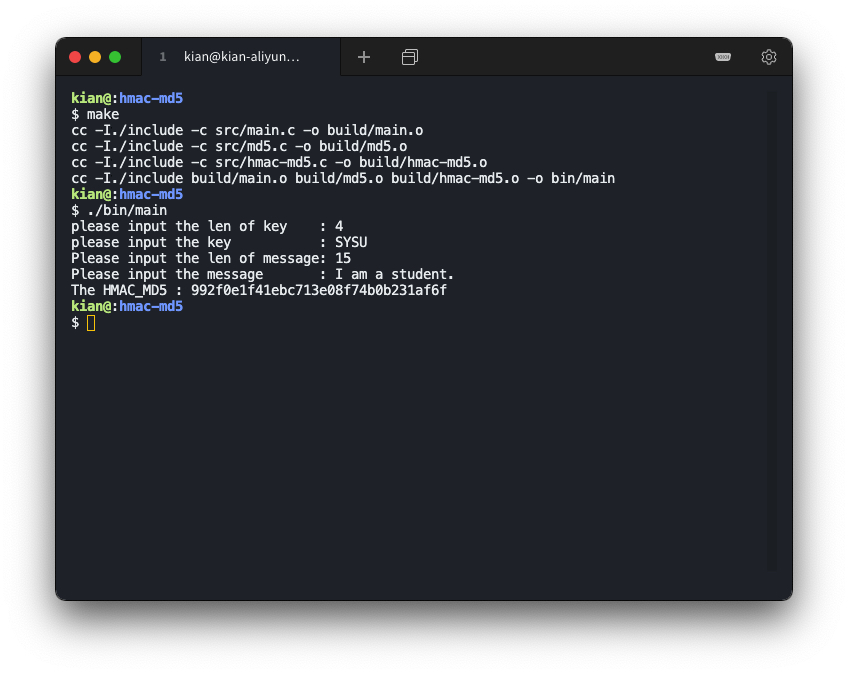
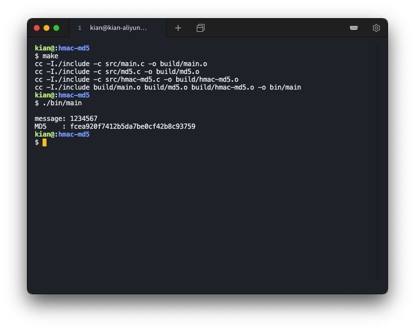
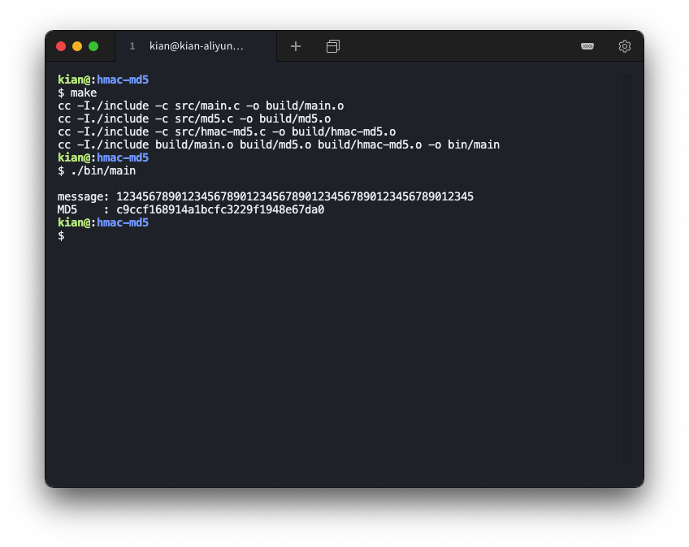
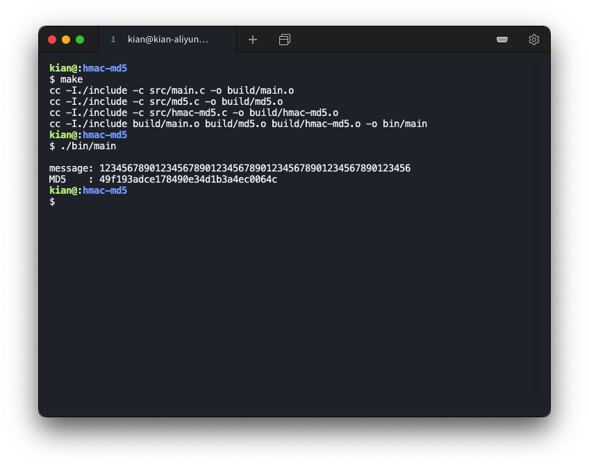
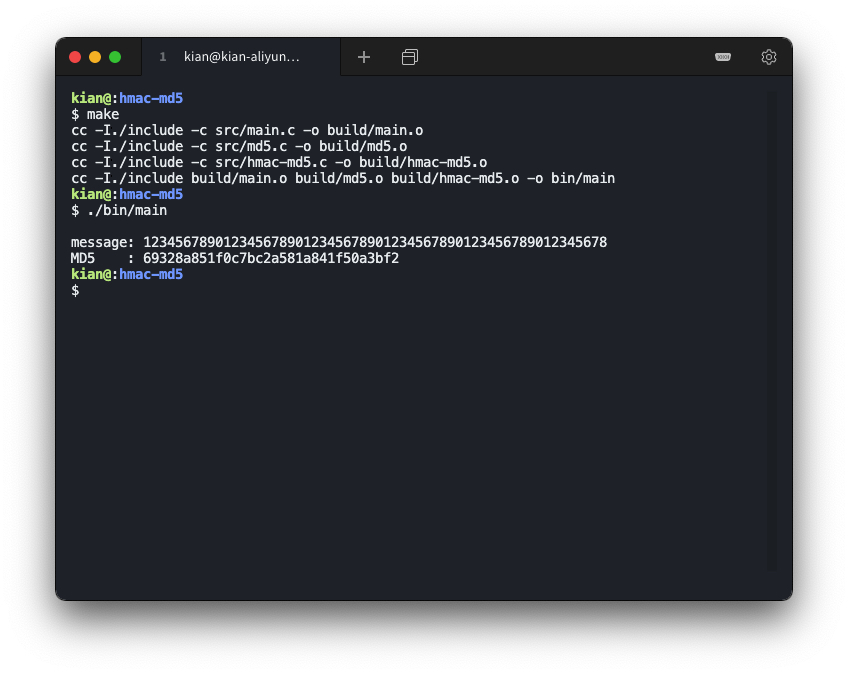
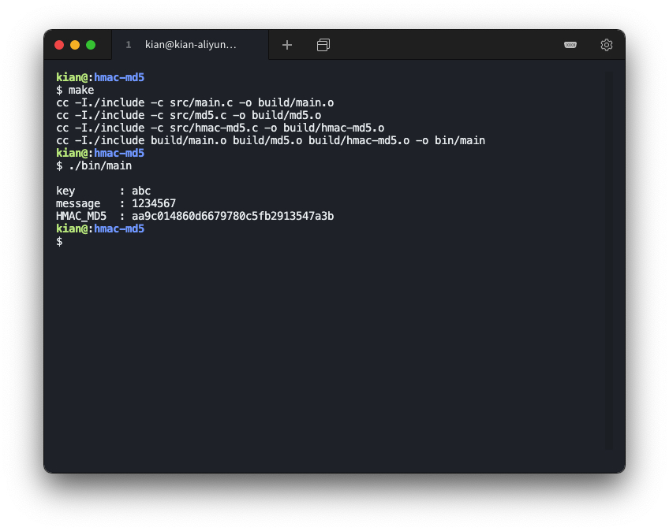
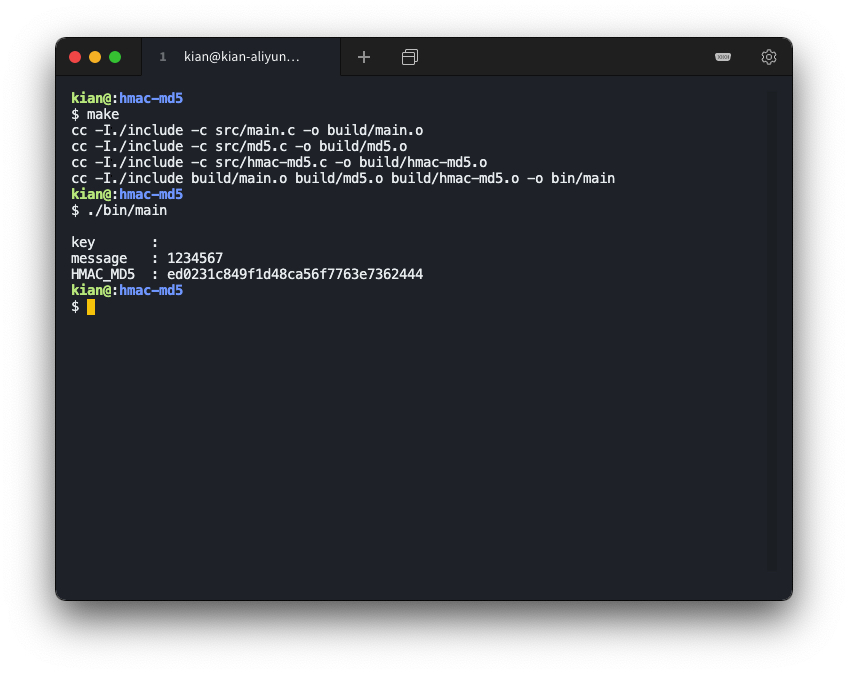
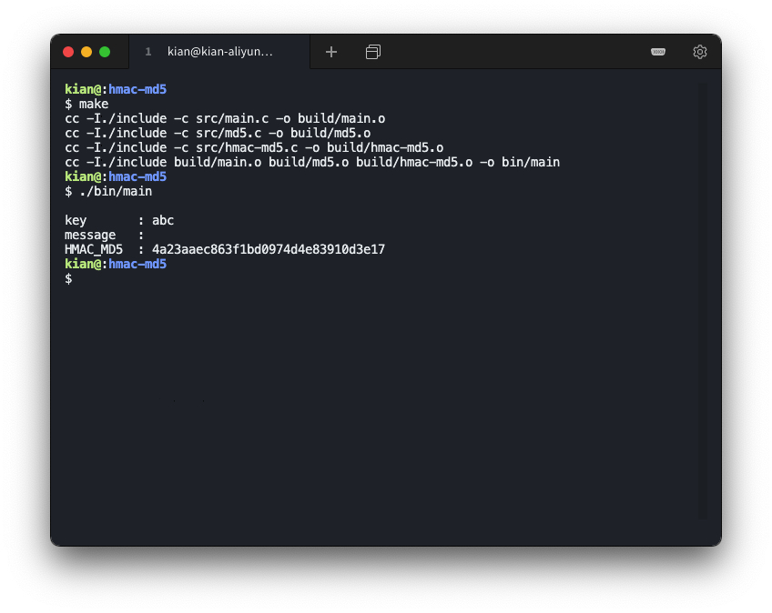

# HMAC-MD5

### 环境说明

操作系统：`Ubuntu 18.04.4 LTS (GNU/Linux 4.15.0-96-generic x86_64)`

编译工具：`gcc version 7.5.0 (Ubuntu 7.5.0-3ubuntu1~18.04)`

### 编译运行结果

编译

```shell
$ make
cc -I./include -c src/main.c -o build/main.o
cc -I./include -c src/md5.c -o build/md5.o
cc -I./include -c src/hmac-md5.c -o build/hmac-md5.o
cc -I./include build/main.o build/md5.o build/hmac-md5.o -o bin/main
```

运行

```shell
$ ./bin/main 
please input the len of key    : 4
please input the key           : sysu
Please input the len of message: 15
Please input the message       : I am a student.
The HMAC_MD5 : 7a4f086dfa4dab061a429a597d8e9347
```



### 验证用例

MD5 测试 1

输入信息的长度：7

输入信息的内容：1234567

输出：fcea920f7412b5da7be0cf42b8c93759



MD5 测试 2

输入信息的长度：0

输入信息的内容：

输出：d41d8cd98f00b204e9800998ecf8427e


MD5 测试 3

输入信息的长度：55

输入信息的内容：1234567890123456789012345678901234567890123456789012345

输出：c9ccf168914a1bcfc3229f1948e67da0



MD5 测试 4

输入信息的长度：56

输入信息的内容：12345678901234567890123456789012345678901234567890123456

输出：49f193adce178490e34d1b3a4ec0064c



MD5 测试 5

输入信息的长度：58

输入信息的内容：1234567890123456789012345678901234567890123456789012345678

输出：69328a851f0c7bc2a581a841f50a3bf2



HMAC MD5 测试 1

输入密钥的长度：3

输入密钥的内容：abc

输入信息的长度：7

输入信息的内容：1234567

输出：aa9c014860d6679780c5fb2913547a3b



HMAC MD5 测试 2

输入密钥的长度：0

输入密钥的内容：

输入信息的长度：7

输入信息的内容：1234567

输出：ed0231c849f1d48ca56f7763e7362444



HMAC MD5 测试 3

输入密钥的长度：3

输入密钥的内容：abc

输入信息的长度：0

输入信息的内容：

输出：4a23aaec863f1bd0974d4e83910d3e17



HMAC MD5 测试 4

输入密钥的长度：3

输入密钥的内容：abc

输入信息的长度：54

输入信息的内容：123456789012345678901234567890123456789012345678901234567

输出：3ea7d18417304f45b46e8b60e6faad70


HMAC MD5 测试 5

输入密钥的长度：3

输入密钥的内容：abc

输入信息的长度：58

输入信息的内容：1234567890123456789012345678901234567890123456789012345678

输出：24d94cc8b4e514f211c84682b9846988

