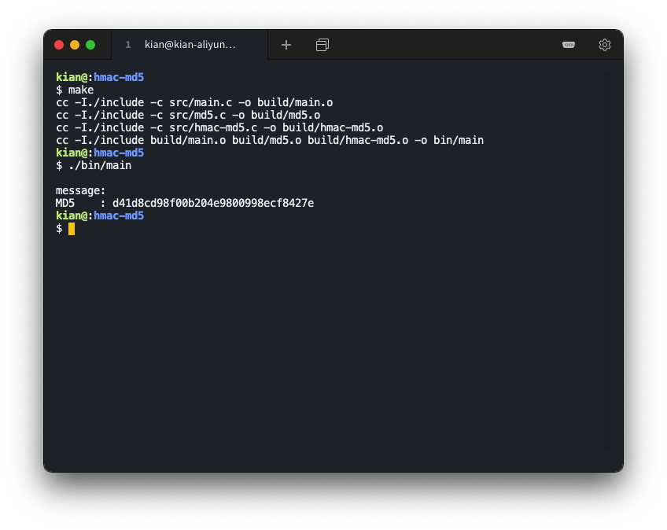

# HMAC-MD5

### 理解

过程
* 填充
    * 先填充一个 1，再填充多个 0，直到信息长度对 512 取模等于 448
    * 填充数据长度
        * 填充 64 位的数据长度
        * 注意数据长度表示信息的比特数，而不是字节数
* 缓冲区初始化
    * 初始化 4 个 32 位缓冲区 A、B、C、D
* 分块
    * 将填充后的信息每 512 位分为一个块
* 循环压缩
    * 4 轮循环，每轮循环进行 16 次迭代运算，共进行 64 次迭代运算
    * 每次运算修改缓冲区的数据，缓冲区的数据作为下一次迭代的输入
    * 4 轮循环使用 4 种（F、G、H、I）函数
    * 在 16 次迭代运算中，每次在块中取不同的部分（g 表），添加不同的固定值（K 表），循环左移不同的位数（s 表）。
* 得出结果
    * 将 4 个 32 位缓冲区拼接得到 128 位结果

参考文献

* [RFC 1321](https://www.rfc-editor.org/rfc/rfc1321.html) 
* [Wiki MD5](https://en.wikipedia.org/wiki/MD5)


### 环境说明

操作系统：`Ubuntu 18.04.4 LTS (GNU/Linux 4.15.0-96-generic x86_64)`

编译工具：`gcc version 7.5.0 (Ubuntu 7.5.0-3ubuntu1~18.04)`

### 编译运行结果

编译

```shell
$ make
cc -I./include -c src/main.c -o build/main.o
cc -I./include -c src/md5.c -o build/md5.o
cc -I./include -c src/hmac-md5.c -o build/hmac-md5.o
cc -I./include build/main.o build/md5.o build/hmac-md5.o -o bin/main
```

运行

```shell
$ ./bin/main 
please input the len of key    : 4
please input the key           : sysu
Please input the len of message: 15
Please input the message       : I am a student.
The HMAC_MD5 : 7a4f086dfa4dab061a429a597d8e9347
```


### 验证用例

MD5 测试 1

输入信息的长度：7

输入信息的内容：1234567

输出：fcea920f7412b5da7be0cf42b8c93759


MD5 测试 2

输入信息的长度：0

输入信息的内容：

输出：d41d8cd98f00b204e9800998ecf8427e



MD5 测试 3

输入信息的长度：55

输入信息的内容：1234567890123456789012345678901234567890123456789012345

输出：c9ccf168914a1bcfc3229f1948e67da0


MD5 测试 4

输入信息的长度：56

输入信息的内容：12345678901234567890123456789012345678901234567890123456

输出：49f193adce178490e34d1b3a4ec0064c


MD5 测试 5

输入信息的长度：58

输入信息的内容：1234567890123456789012345678901234567890123456789012345678

输出：69328a851f0c7bc2a581a841f50a3bf2


HMAC MD5 测试 1

输入密钥的长度：3

输入密钥的内容：abc

输入信息的长度：7

输入信息的内容：1234567

输出：aa9c014860d6679780c5fb2913547a3b


HMAC MD5 测试 2

输入密钥的长度：0

输入密钥的内容：

输入信息的长度：7

输入信息的内容：1234567

输出：ed0231c849f1d48ca56f7763e7362444


HMAC MD5 测试 3

输入密钥的长度：3

输入密钥的内容：abc

输入信息的长度：0

输入信息的内容：

输出：4a23aaec863f1bd0974d4e83910d3e17


HMAC MD5 测试 4

输入密钥的长度：3

输入密钥的内容：abc

输入信息的长度：54

输入信息的内容：123456789012345678901234567890123456789012345678901234567

输出：3ea7d18417304f45b46e8b60e6faad70


HMAC MD5 测试 5

输入密钥的长度：3

输入密钥的内容：abc

输入信息的长度：58

输入信息的内容：1234567890123456789012345678901234567890123456789012345678

输出：24d94cc8b4e514f211c84682b9846988

